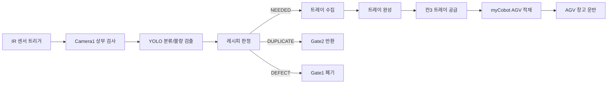

# VisiPick

비정지 컨베이어 위의 전자부품을 카메라로 검사하고, 레시피에 맞춰 분류한 뒤 트레이와 AGV까지 이어지는 미니 스마트팩토리 셀입니다.

상부 카메라로 부품 종류와 외관 불량을 판정하고, 필요한 부품은 트레이에 수집합니다. 중복품과 불량품은 게이트 푸셔로 분리하고, 트레이가 완성되면 myCobot이 AGV에 적재합니다. 전체 상태는 Python 서버가 기준이 되며, WPF HMI는 API, WebSocket, MQTT, MJPEG 영상으로 화면을 구성합니다.

## 주요 기능

- 상부 YOLO 모델 기반 부품 4종 분류 및 불량 검출
- 10프레임 멀티프레임 판정으로 순간 오검출 완화
- 레시피 기반 `NEEDED`, `DUPLICATE`, `DEFECT` 분류
- ESP32 시리얼 통신으로 컨베이어, 게이트 푸셔, 트레이 공급 제어
- myCobot 280 경로 재생 방식 트레이 이재
- MQTT 기반 AGV 출발, 창고 도착, 자동 복귀 상태 관리
- FastAPI REST, WebSocket, MJPEG 영상 스트림 제공
- SQLite 검사 이력, 레시피 세션, AGV 미션, 이벤트 저장
- Mock 장비로 하드웨어 없이 서버 흐름 테스트 가능

## 시스템 흐름



## 기술 스택

| 영역 | 사용 기술 |
|------|-----------|
| 중앙 제어 | Python, FSM |
| API/HMI 연동 | FastAPI, WebSocket, MJPEG |
| 비전 | OpenCV, Ultralytics YOLO |
| 장비 통신 | USB Serial, TCP Socket, MQTT |
| 로봇 | myCobot 280, pymycobot socket server |
| AGV | ESP32-CAM, MQTT |
| 데이터 | SQLite WAL |
| 테스트 | MockESP32, MockMyCobot, MockAGV, MockBroker |

## 구현 포인트

### Python Central Server

`src/core/state_machine.py`가 전체 공정의 기준 상태를 관리합니다. 센서 트리거, 검사, 게이트 예약, 트레이 완성, 로봇 이재, AGV 출발까지 한 흐름으로 묶었습니다. 장비별 상태를 여러 곳에서 따로 판단하지 않도록 Python 서버를 단일 기준으로 두었습니다.

### 비전 검사

상부 카메라는 `models/best.pt` YOLO 모델을 사용합니다. `IC`, `TB`, `HS`, `CAP` 4종 부품과 `Broken`, `Dented`, `Pinbent` 불량 클래스를 처리합니다. 한 번의 추론 결과만 쓰지 않고 설정된 시간 동안 여러 프레임을 검사해 결과를 고릅니다.

측면 핀 검사는 `src/vision/pin_inspector.py`에 분리했습니다. 핀 방향, 기대 핀 수, HSV 몸체 분리, 금속 핀 마스크 같은 값은 `config/config.json`에서 조정할 수 있게 했습니다.

### 장비 제어

ESP32는 JSON line 형식으로 명령을 받습니다.

- `conveyor_cmd`: 메인 컨베이어 속도 설정
- `gate_cmd`: 게이트 푸셔 동작
- `tray_cmd`: 다음 트레이 공급
- `emergency_stop`: 컨베이어와 게이트 정지

게이트는 검사 위치와 실제 게이트 위치 사이 거리를 고려해 지연 발사합니다. 부품별 미세 보정값도 설정으로 따로 두었습니다.

### AGV와 로봇

트레이가 완성되면 컨3이 트레이 위치를 이동시키고, myCobot이 AGV 슬롯에 트레이를 올립니다. AGV는 `trays_per_load` 개수만큼 적재되면 출발합니다. MQTT 상태 메시지로 창고 도착, 홈 복귀, START 복귀를 추적하고, 홈 점유 상태는 Python 쪽에서 관리합니다.

### HMI 연동

WPF 화면은 Python 서버에서 데이터를 받아 표시하는 구조입니다.

- REST: 검사 이력, 통계, 세션, AGV 상태 조회
- WebSocket: MQTT 이벤트를 화면으로 push
- MJPEG: `/video/top`, `/video/side` 실시간 영상
- REST 제어: 비전 시작/정지, 컨베이어 시작/정지, 비상정지, 수동 게이트/로봇/AGV 제어

## 폴더 구조

```text
src/
├── api/             FastAPI, WebSocket, MJPEG
├── core/            FSM, DB, AGV MQTT, frame bus
├── devices/         ESP32 serial, myCobot control
├── orchestrator/    판정, 레시피, 트레이 관리
├── utils/           설정, 로깅, DB 초기화
└── vision/          카메라, YOLO 분류, 핀 검사

mock/                하드웨어 mock 서버
config/              실행 설정, robot path
Hardware-Connect/    ESP32 펌웨어
tests/               자동 테스트와 통합 테스트
tools/               카메라/로봇/AGV 단독 점검 도구
```

## 실행 방법

Python 패키지 임포트 기준이 `src` 패키지라서 프로젝트 루트에서 `-m` 방식으로 실행합니다.

```powershell
cd C:\VisiPick
pip install -r requirements.txt
python -m src.utils.db_init
```

MQTT 브로커:

```powershell
docker-compose -f config/docker-compose.yml up -d
```

API 서버:

```powershell
python -m src.api.api_server
```

FSM:

```powershell
python -m src.core.state_machine
```

하드웨어 없이 흐름만 확인할 때는 `config/config.json`의 dummy 설정을 켜고 mock 서버를 사용합니다.

```powershell
python -m mock.MockBroker
python -m mock.MockESP32
python -m mock.MockMyCobot
python -m mock.MockAGV
```

## API 예시

| Method | Endpoint | 설명 |
|--------|----------|------|
| GET | `/api/health` | 서버 상태 |
| GET | `/api/inspections` | 검사 이력 |
| GET | `/api/stats` | 검사 통계 |
| GET | `/api/agv/status` | AGV 상태 |
| GET | `/video/top` | 상부 카메라 MJPEG |
| GET | `/video/side` | 측면 카메라 MJPEG |
| POST | `/api/conveyor/start` | 컨베이어 시작 |
| POST | `/api/emergency_stop` | 비상정지 |
| POST | `/api/gate/{gate_no}/push` | 수동 게이트 푸시 |
| POST | `/api/robot/transfer` | 수동 트레이 이재 |

Swagger 문서는 실행 후 `http://localhost:8000/docs`에서 확인할 수 있습니다.

## 테스트와 점검 도구

```powershell
python -m tests.auto_test
python -m tests.testsets
python -m tests.gate_loop
python tools/list_cameras.py
python tools/test_ir_trigger.py
python tools/test_robot.py
python tools/test_agv.py
```

## 작업하면서 해결한 문제

- 카메라 버퍼 누적으로 검사 결과가 늦게 나오는 문제를 최신 프레임 그래버 방식으로 정리
- 저신뢰/미검출을 바로 폐기하지 않고 반환 라인으로 보내 재검사 가능하게 처리
- 비상정지를 프로그램 종료가 아니라 일시정지로 바꿔 레시피 진행 상태를 유지
- 트레이 이재를 백그라운드로 돌려 다음 부품 검사가 막히지 않게 구성
- AGV 홈 점유 상태를 서버에서 관리해 여러 AGV가 같은 홈으로 들어가는 상황 방지
- 조명과 촬영각에 민감한 측면 핀 검사는 코드 수정 없이 설정값으로 튜닝 가능하게 분리

## 시연 영상

[](https://youtu.be/2qZNNgGABPE)

영상 링크: https://youtu.be/2qZNNgGABPE
